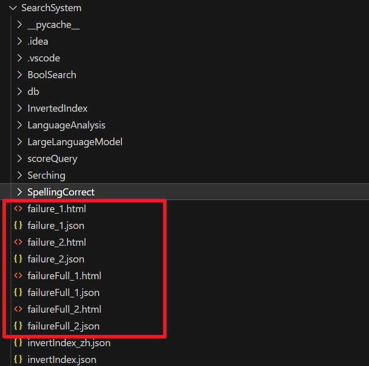

# 信息检索系统

利用倒排索引和向量空间模型实现的信息检索系统.

## 完成工作：
- 带位置信息的倒排索引
- 向量空间模型
- TOP K查询
- BOOL查询
- 短语查询
- 拼写矫正
- 同义词查询
- 拼写矫正（短语）

# 运行
环境要求：python3 

在初次运行程序前请下载词干还原依赖的语料库

在`SearchSystem/main.py`中已经注释掉下载语料库的命令
```python
nltk.download("wordnet")
nltk.download("averaged_perceptron_tagger")
nltk.download("punkt")
nltk.download("maxnet_treebank_pos_tagger")
```
取消注释后运行一次即可，语料库下载完成即可正常运行

windows下如果嫌弃语料库下载比较慢，可以直接将该目录下的`nltk_data`文件夹替换掉user下的`AppData/Roaming/nltk_data`文件夹，根目录的`nltk_data`文件夹是已经下载好的语料库

语料库下载完成后请将相应的下载语注释掉。

在`SearchSystem`目录下运行命令：
```batch
python main.py
```
> 注意：运行前请不要修改工程文件的名字和相对位置

`SearchSystem`工程目录是pycharm的工程

# 实现功能
## 词干还原
利用python中自然语言处理的库：nltk对文章中的单词进行词干还原。

在词干还原的过程中会去除无用的标点符号。

## 索引构建
带位置信息的倒排索引：

例子：
```json
{
    "word1":{
        "1":[5,6,10],
        "5":[10,20,30]
    },
    "word2":{
        "2":[5,6,10],
        "33":[15,28,30]
    }
    ···
}
```
索引事先建立好储存在文件中，每次运行程序时将索引加载到内存中。

## 向量空间模型
通过查询向量计算出文档的wf-idf评分进行排序。

wf-idf计算方法：
1. 首先对query中出现的单词对应的文档列表取并集。
2. 随后对query中出现的单词对文档进行wf-idf计算并评分。
3. 得到所有文档对该查询的评分后再对所有文档进行排序。

wf-idf 和 tf-idf比较：
1. 通过log计算削弱词项频率对评分的影响。
2. 一篇文章中单词出现n次不代表其权重扩大n倍。

## TOP K 查询
首先通过向量空间模型得到所有文档的评分。

通过堆排序建好最小堆以后进行K次precDown操作。

堆最后的K个元素即为评分前K大的元素。

## 短语查询
利用带位置信息的倒排索引。

首先得到包含query中所有单词的文档列表的交集。

从这些文档集中根据位置索引查找是否有匹配的短语。

遍历第一个词项在文档中的位置，依次检测后面的词项位置中是否包含与其匹配的位置。

## 通配符查询
利用正则表达式找到所有匹配的词项，利用倒排索引检索出词项对应的文档。

支持通配符的短语查询：

首先将检索到的词项存在一个二维数组中，随后对出现的每个短语组合进行短语查询。

## 同义词查询
同样利用nltk语言处理库获取单个单词的同义词列表（有可能是短语）

随后对每个单词或者短语进行检索，获取文档集。

## BOOL查询

- 将查询表达式转为后序表达式：
如 A OR B AND C 转为
     A B C AND OR 

- 用一个栈来计算后序表达式

## LLM查询

- 使用大模型回答，需要在本地添加环境变量`$env:OPENAI_API_KEY = "xxx"`
- 首次调用LLM时开始embeding，而不是系统启动时

# 额外工具
## FileTransfer 模块
- 该模块可自动将对应格式转换为reuter文件夹中的标准格式
- 使用方法如下
   1. 把文件放入指定`content`文件夹即可，以doc文件举例
   2. 在`FileTransfer`文件夹下运行`python file_transfer.py`

## tester 模块
- 该模块用于测评召回的准确度
- 使用方法，在`SearchSystem`件夹下运行`python tester.py`
- 结果为几个json和html
- `failure_x`为第x个召回方法的简化错误信息
- `failureFull_x`为第x个召回方法的完整错误信息
- 


 
